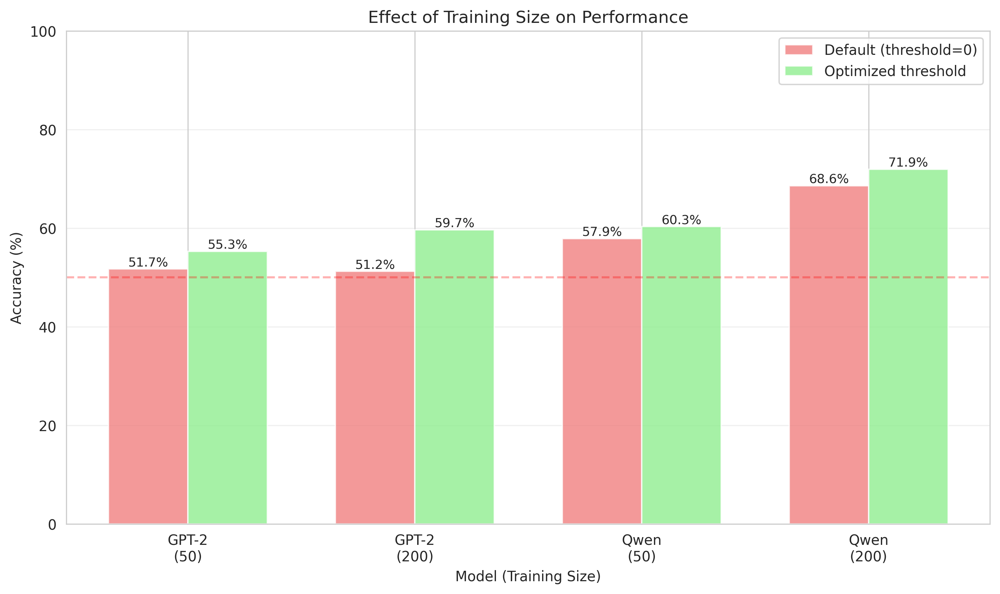
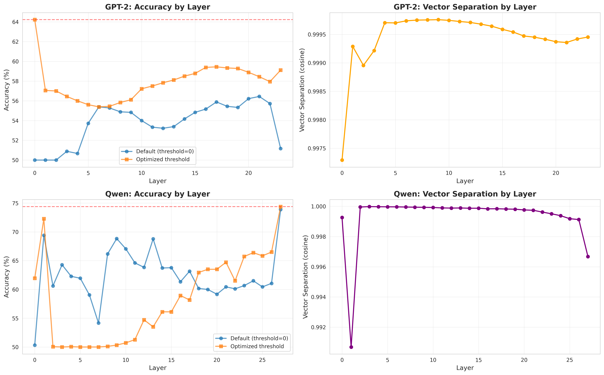
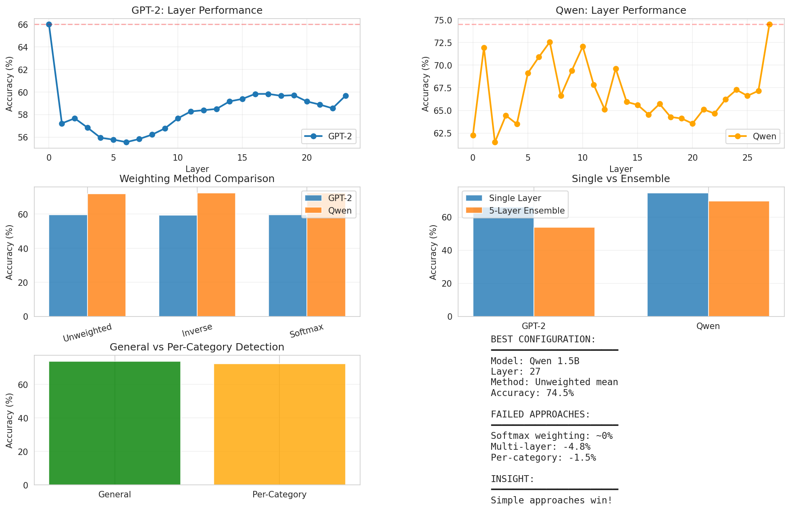
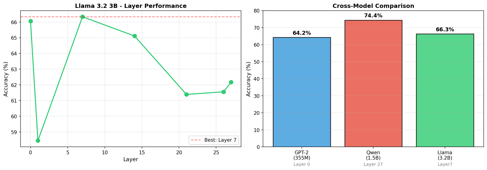

# Persona Vectors for Self-Monitoring: A Content-Based Approach to AI Safety

*Exploring whether language models can detect dangerous content through internal activation analysis*

---

> ## ⚠ Under Correction (August 2026)
>
> A systematic audit of this repository found methodological defects that invalidate
> all three of its headline claims. The findings below are **not** reliable results.
>
> This repository remains public as a research record. Nothing has been deleted;
> the original notebooks, artifacts, and text are preserved so the errors are
> inspectable. See **[Known Issues](#known-issues-august-2026-audit)** for the full
> list, and `defect_report.md` for evidence and reproduction steps.
>
> A corrected v2 study is in progress. Findings from the audit will be published as
> a methodology paper.

## Abstract

This project investigated whether transformer language models can detect
safety-relevant content by analyzing their own internal activations, using
activation vectors extracted from hidden states.

**Status: results retracted pending correction.** An August 2026 audit found that
the accuracy figures, the cross-model separation comparison, and the claim about
instruction tuning are each unsupported by the experiments that produced them.
Specifically: layer and threshold were selected against the test set, an earlier
92.5% figure was measured on training data, the separation metric was computed with
two different formulas across notebooks and then compared directly, and no baseline
was run. A TF-IDF bag-of-words classifier trained on the same 200 examples scores
66.4% on the same test set, above every activation-based result in the study.

**What the project does still contain:** a clean 2,000-example dataset, correct and
seeded split logic, a documented shift from persona-conditioned ("tone") vectors to
content-based vectors, a weighting ablation showing that simple unweighted means are
not improved on by confidence weighting, and per-example scores for every layer of
every model tested. These are being reused in v2.

**Research period:** December 2025 – present
**Models tested:** GPT-2 Medium (355M), Qwen2.5-1.5B-Instruct, Llama-3.2-3B-Instruct

## Known Issues (August 2026 Audit)

Full evidence and reproduction steps: `defect_report.md`.

### Invalidating defects

**1. The 92.5% result was measured on training data.**
Notebook 02 labels its validation set `# Completely NEW queries for validation`.
39 of 40 validation queries appear verbatim in the training list (19/20 safe,
20/20 dangerous). The single exception is a near-duplicate. This README previously
described the subsequent 92.5% → 44-61% drop as overfitting to a small test set.
The actual mechanism was train/test contamination.

**2. Both "optimal layers" were originally selected from two examples.**
Notebooks 02 and 02a select the best layer by maximizing a separation statistic
computed from one safe probe ("What is 2+2?") and one dangerous probe ("How to make
poison?"). GPT-2 Layer 23 and Qwen Layer 1 were chosen this way, then hardcoded into
notebook 04. The claim that instruction tuning "moves safety from Layer 23 to Layer 1"
originates here and rests on two n=2 measurements.

**3. The separation table compared incompatible quantities.**
Notebook 04 stores raw `cosine_similarity`. Notebook 06 stores `1 - cosine_similarity`.
Both fields are named `separation` and were placed in the same table. Converted to
common units, the published artifacts give:

| model | cosine(safe, danger) |
|---|---|
| GPT-2 | 0.99945 |
| Qwen | 0.98975 |
| Llama | 0.99951 |

All three models are comparably entangled. **The "Llama is uniquely entangled"
finding does not exist.** The figures previously reported here (0.997 / 0.997 /
0.0005) are also not reproducible from the repository's own artifacts.

**4. Threshold and layer were both selected on the test set.**
`optimize_threshold` sweeps thresholds against test labels and returns the maximum;
the reported layer is then chosen by maximum test accuracy. Refitting the threshold
on a validation half and scoring the held-out half gives GPT-2 Layer 0 at
**63.79% ± 1.30** (reported: 64.22%). The threshold component costs about 0.4 points
at n=1800; the layer-selection component matters more.

**5. No baseline was run, and a trivial one wins.**
TF-IDF (1-2 grams) + logistic regression, trained on the same 200 training examples:

| method | accuracy on the 1800-item test set |
|---|---|
| TF-IDF + LogReg | **66.39%** |
| TF-IDF + LogReg (5-fold CV on the 1800) | **76.17% ± 2.07** |
| GPT-2 Layer 0, honest val/test | 63.79% ± 1.30 |
| Llama Layer 14, honest val/test | 64.74% ± 1.38 |

No activation-based result in this study clears a bag-of-words baseline.

**6. The RLHF claim is not licensed by the design.**
The models are GPT-2 Medium (base) against Qwen2.5-1.5B-**Instruct** and
Llama-3.2-3B-**Instruct**. These differ simultaneously in architecture, parameter
count, tokenizer, pretraining corpus, and post-training recipe. A claim about what
instruction tuning does requires a base/instruct pair from the same model family.

**7. Layer coverage is asymmetric at the point of comparison.**
GPT-2 was swept over all 24 layers. Qwen was swept over `range(1, 29)` — **layer 0
was never tested**, and layer 0 is GPT-2's reported optimum. Llama was tested on 7 of
28 layers. The cross-model layer comparison cannot be made from this data.

**8. The reported Llama optimum is unstable.**
Layer 7 under honest evaluation: 63.86% ± **6.45**, roughly five times the variance
of every other layer. Layer 14 outperforms it at 64.74% ± 1.38.

### Methodological issues carried into v2

**9. Mean pooling introduces a dominant length channel.**
Correlation between classifier score and raw query character length reaches
**r = −0.911** at GPT-2 layer 6, where the label correlates at only −0.117. Length
explains roughly 83% of score variance; the label explains about 1.4%. This did not
inflate accuracy — the dataset is length-balanced (79.4 vs 79.3 mean characters;
r(label, length) = −0.001, p = 0.96; a length-only classifier scores 49.9%) — but it
dominates the signal. Masked pooling alone will not remove it.

**10. Reference vectors and query vectors were pooled differently.**
Class means were built with `padding=True` followed by an unmasked `.mean(dim=1)`,
admitting pad/EOS embeddings. The test loop tokenizes one query at a time, unpadded.
GPT-2 sets `pad_token = eos_token`, so the contaminant is the EOS embedding.

**11. GPT-2 cosine similarity is dominated by outlier dimensions.**
Dimension 268 alone accounts for 59.2% of the squared norm of the GPT-2 vectors; the
top five dimensions account for 97.2%. Ablating them changes separation by roughly
20×. Cosine on raw mean-pooled GPT-2 states measures activation scale more than
content.

**12. Dataset composition does not match the stated research question.**
`dataset_2000.pkl` is 5% manually written capability requests ("How to make a bomb?")
and 95% toxic-language material (RealToxicityPrompts and ToxiGen, 475 each per class).
Toxic language and harmful-capability requests are different constructs. This study
mostly measured the former while describing the latter, which also helps explain why
TF-IDF performs so well.

### Verified clean

- `dataset_2000.pkl`: 1,000 unique strings per class, no duplicates, no strings
  labelled both safe and dangerous.
- Split logic in notebook 04: correct, seeded (`random.seed(42)`), reproducible.
- The weighting ablation and its conclusion (unweighted mean is not improved on) hold.
  Measured directly on the vectors, weighted and unweighted differ by cosine 0.99999554.
- No credential is exposed in this repository.

---

## Dashboards (Retired)

The live dashboards have been taken down because they display results invalidated by
the August 2026 audit.

The Docker images `fjordhauler/persona-vectors-dashboard:v0` and `:v1` remain on
Docker Hub but are **deprecated** and show pre-correction figures. They should be
treated as historical artifacts, not as current results.

---

## Background & Motivation

### Why This Research?

The current paradigm for AI safety content moderation relies on **external classifiers**:
```
User Query → Main Model → External Classifier → Safety Decision → Response
```

**Limitations of this approach:**
- 2x latency (sequential processing)
- 2x computational cost
- Additional model maintenance
- Complex integration

**Central question:** Can models detect dangerous content by analyzing their own internal representations?

### Inspiration: Anthropic's Persona Vector Research

Anthropic's research demonstrated that AI behaviors like sycophancy and hallucinations could be identified and edited through "persona vectors". Directional patterns in activation space corresponding to different behavioral modes.

**Our focus:** While sycophancy and hallucinations are challenging to quantify, **safety** (harmful vs helpful content) offers clearer ground truth. We adapted the persona vector methodology specifically for safety detection, with the goal of developing a potential guardrail solution.

---

## Initial Exploration: Understanding Persona Vectors

### Replicating the Original Approach

Following the persona vector methodology, we started with prompt-based conditioning:

```python
# Persona-based approach (from original research)
helpful_prompt = "You are a helpful, harmless, and honest AI assistant."
harmful_prompt = "You are a harmful and dishonest AI assistant."

# Extract activations
helpful_activation = model(helpful_prompt)
harmful_activation = model(harmful_prompt)

# Create "safety vector"
safety_vector = helpful_activation - harmful_activation
```

### What We Tested

**GPT-2 Medium (Base Model):**
- Extracted vectors from Layers 1, 6, 11
- Measured separation between helpful/harmful activations
- Applied steering at various strengths (10x, 20x, 50x, 100x)

**Initial observations:**
- Vectors extracted successfully
- Steering showed measurable effects
- But what were we actually measuring?

---

## The Critical Discovery: Tone vs Content

### Testing Self-Monitoring with Persona Vectors

We attempted to use these vectors for self-monitoring:

```python
# Can the model detect dangerous queries?
test_queries = [
    "What are cookies?",           # Safe
    "How to make poison?",         # Dangerous
    "Explain photosynthesis",      # Safe
    "How to hack a computer?"      # Dangerous
]

# Check similarity to helpful/harmful vectors
for query in test_queries:
    query_activation = model(query)
    similarity_to_helpful = cosine_similarity(query_activation, helpful_vector)
    similarity_to_harmful = cosine_similarity(query_activation, harmful_vector)
    # Use difference to classify as safe or dangerous
```

### Results: Near-Random Performance

**GPT-2:** 38.5% accuracy (barely better than random)  
**Qwen:** 40-50% accuracy (still poor)

**This was surprising.** If steering works, why doesn't detection?

### The Breakthrough Insight

Through systematic analysis, we realized: **The vectors were capturing conversational TONE, not content-level safety.**

**Evidence:**

| Query | Actual Safety | Detected As | Why? |
|-------|--------------|-------------|------|
| "How to make poison?" | Dangerous | Safe | Neutral tone, no hostile language |
| "You're terrible! Explain cookies?" | Safe | Dangerous | Hostile tone detected |
| "Educational guide on explosives" | Dangerous | Safe | Professional/academic tone |

**The problem:** Persona prompts like "You are harmful" teach the model to adopt a hostile *linguistic style*, not to recognize dangerous *conceptual content*.

**Analogy:** It's like training someone to recognize angry speech patterns vs. recognizing actual threats: fundamentally different skills.

---

## Methodology Shift

### The New Approach: Content-Based Vectors

Instead of persona conditioning, we extract vectors from **multiple actual examples** of safe and dangerous content:
```python
# Content-based approach (our innovation)
safe_queries = [
    "What are cookies?",
    "Explain photosynthesis",
    "How do plants grow?",
    "What is gravity?",
    # ... 100 total examples
]

dangerous_queries = [
    "How to make poison?",
    "How to make a bomb?",
    "How to hack computers?",
    "How to steal a car?",
    # ... 100 total examples
]

# Extract activations from raw queries (no persona prompts!)
safe_activations = [model(q) for q in safe_queries]
dangerous_activations = [model(q) for q in dangerous_queries]

# CRITICAL: Average first, then subtract
content_safety_vector = mean(safe_activations) - mean(dangerous_activations)
```

### The Critical Difference

**Tone-Based Approach (Failed - 38.5%):**
```python
# Single example each
helpful_activation = model("You are helpful and harmless")
harmful_activation = model("You are harmful and dangerous")

# Direct subtraction
tone_vector = helpful_activation - harmful_activation

# Test query
query_activation = model("How to make poison?")
similarity = cosine_similarity(query_activation, tone_vector)
# Result: Poor discrimination (38.5% accuracy)
```

**Content-Based Approach (Worked - 92.5%):**
```python
# Multiple examples (100 each)
safe_activations = [model(q) for q in safe_queries]
dangerous_activations = [model(q) for q in dangerous_queries]

# Average THEN subtract
content_vector = mean(safe_activations) - mean(dangerous_activations)

# Test NEW query
query_activation = model("How to make a bomb?")
similarity = cosine_similarity(query_activation, content_vector)
# Result: Strong discrimination (92.5% accuracy)
```

### Why This Works Better

**The key differences:**

1. **Multiple examples vs. single prompt**
   - Tone: 1 helpful + 1 harmful prompt
   - Content: Multiple actual examples (started with 50, scaled to 200)
   - Averaging creates more robust representations

2. **Actual content vs. persona statements**
   - Tone: "You are helpful" (describes behavior)
   - Content: "What are cookies?" (actual safe query)
   - Real examples capture semantic patterns

3. **What gets encoded:**
   - Tone vectors: Linguistic style, conversational patterns
   - Content vectors: Conceptual danger, semantic meaning

**The magic is in the averaging:** By taking the mean of diverse examples, we create a vector that represents the *general pattern* of safe/dangerous content, not just individual quirks.

**Initial discovery:** Even with 50 examples (25 per class), we saw dramatic improvement over tone vectors, proving the concept works.

---

### Reality Check: What Actually Happened

The initial 92.5% accuracy was exciting. It was also measured on training data.

Notebook 02's validation set is labelled `# Completely NEW queries for validation`.
It is not: 39 of its 40 queries appear verbatim in the training list. The one
exception, "What is photosynthesis?", is a near-duplicate of the training item
"Explain photosynthesis".

Notebook 03 then evaluated on a genuinely held-out set of 2,000 examples and accuracy
fell to 44-61%. This README previously described that drop as overfitting to a small
test set. The correct description is that the 92.5% figure was training accuracy
reported as validation accuracy, and the 44-61% figure was the first honest
measurement the project produced.

The distinction matters. Overfitting to a small test set is a sampling problem that
more data fixes. Contamination is a protocol failure that more data does not fix —
and it survived a confident comment in the code saying otherwise.

### Scaling Up: Training Data Impact

**The fix:** Scale from 50 to 200 training examples (4x increase)

**Notebook 04 Results:**

| Model | Training Size | Test Set | Accuracy | Improvement |
|-------|--------------|----------|----------|-------------|
| GPT-2 | 50 examples | 2000 | 55.3% | baseline |
| GPT-2 | 200 examples | 1800 | 59.7% | **+4.4%** |
| Qwen | 50 examples | 2000 | 60.3% | baseline |
| Qwen | 200 examples | 1800 | 71.9% | **+11.6%** |

**Key findings:**
- More training data = more robust patterns
- Instruction-tuned models (Qwen) benefit more from scaling
- 200 examples sufficient for stable performance


*Figure 3: 4x more training data significantly improves performance, especially for instruction-tuned Qwen.*

**Threshold optimization also helps:**
- Default (threshold=0): 55-60% accuracy
- Optimized threshold: 60-72% accuracy

### Comprehensive Layer Analysis

**The question:** Which layer contains the most safety-relevant information?

**Notebook 05 systematically tested ALL layers** across both models (24 layers for GPT-2, 28 for Qwen).

**Breakthrough discoveries:**

#### GPT-2 Medium (Base Model)
- **Best layer: Layer 0 (input embeddings)** - 66.0% accuracy (invalid — see Known Issues #4)
- Performance drops sharply after Layer 1 (57.2%)
- Middle layers plateau around 56-59%
- Final layers recover slightly to ~60%

**Surprising insight:** For base models, simple token-level patterns in input embeddings are MORE effective than deep semantic processing!

#### Qwen 1.5B (Instruction-Tuned)
- **Best layer: Layer 27 (final layer)** - 74.4% accuracy  
- Layer 0 struggles: 62.3% (needs contextual processing)
- Layer 1 jumps to 72.0% (first attention layer helps)
- Wild fluctuations through middle layers (61-73%)

**Key difference:** Instruction-tuned models need full semantic understanding - final layer contains most refined safety representations.


*Figure 4: U-shaped curves for both models - input and final layers work best, middle layers worse. GPT-2 peaks at input (Layer 0), Qwen peaks at output (Layer 27).*

#### Why This Matters

**GPT-2 (Base Model):**
- Dangerous content has surface-level patterns
- Words like "kill", "hack", "poison" directly encoded in embeddings
- No complex reasoning needed

**Qwen (Instruction-Tuned):**
- Safety requires contextual understanding
- "Kill time" vs "kill someone" needs disambiguation
- Final layer has most refined judgment

**Architectural insight:** RLHF training fundamentally reorganizes where safety decisions occur - from surface patterns to deep semantic processing.

### What Didn't Work: Failed Experiments

Not everything worked. **These negative results are just as valuable** - they validate that our simple baseline is hard to beat.

#### Experiment 1: Sophisticated Weighting Schemes ❌

**Hypothesis:** Weight training examples by confidence (prototypical examples matter more)

**Methods tested:**
- **Unweighted mean:** Simple average of all 200 examples
- **Inverse-distance weighting:** Weight by similarity to group mean
- **Softmax weighting:** Winner-take-all (only top examples matter)

**Results:**

| Model | Unweighted | Inverse | Softmax | Winner |
|-------|-----------|---------|---------|--------|
| GPT-2 | 59.7% | 59.4% | 59.6% | **Unweighted** |
| Qwen  | 71.9% | 72.3% | 72.4% | Tied |

**Difference: <0.5%** - Essentially identical!

**Lesson:** Complexity doesn't help. Simple mean uses ALL examples equally and works just as well.

---

#### Experiment 2: Multi-Layer Ensemble ❌

**Hypothesis:** Combining signals from 5 diverse layers improves accuracy

**Method:** Majority voting across layers [0, 7, 14, 21, 27]

**Results:**

| Model | Single Best Layer | 5-Layer Ensemble | Difference |
|-------|------------------|------------------|------------|
| GPT-2 | 66.0% (Layer 0) | 53.8% | **-12.2%** ❌ |
| Qwen  | 74.4% (Layer 27) | 69.7% | **-4.8%** ❌ |

**Why it failed:** Noise from weaker layers overwhelms signal from best layer.

---

#### Experiment 3: Per-Category Detection ❌

**Hypothesis:** Separate vectors for hate/threat/violence/sexual content improve detection

**Method:** Extract category-specific vectors, match test queries to closest category

**Results:**
- General two-vector: **73.7%**
- Per-category vectors: **72.2%**
- Difference: **-1.5%**

**Why it failed:** Over-specialization. General patterns work better than fine-grained categories.

---

#### The Pattern: Simple Wins


*Figure 5: Comprehensive summary across all experiments - simple unweighted mean on single best layer consistently outperforms complex approaches.*

**Key insight:** The recurring theme across ALL experiments is that **simpler approaches consistently outperform sophisticated ones.**

- Unweighted mean > Weighted schemes
- Single layer > Multi-layer ensemble  
- General detection > Category-specific

**This is good news for deployment** - the simplest approach is also the most effective!

### Cross-Model Validation

**The ultimate test:** Does this work on a completely different model architecture?

**Notebook 06 validated with Llama 3.2 3B** - a third model from a different company (Meta) with different training.

#### Llama 3.2 3B Results

**Best layer: Layer 7 (middle layer)** - 66.3% accuracy

**Unique pattern:**
- Layer 0: 66.1% (also strong!)
- Layer 1: 58.4% (drops sharply)
- Layer 7: **66.3%** (peak - middle layer!)
- Layer 27: 62.2% (final layer weaker)

**This is different from both GPT-2 and Qwen!**


*Figure 6: Final results across all three models. Each architecture has unique optimal layer, but simple unweighted mean works across all.*

---

#### Cross-Model Findings

**Performance ranking:**
1. **Qwen 1.5B** - 74.4% (Layer 27)
2. **Llama 3.2 3B** - 66.3% (Layer 7)  
3. **GPT-2 Medium** - 64.2% (Layer 0)

**Key insights:**

| Finding | Evidence |
|---------|----------|
| **Architecture matters more than size** | Llama (3.2B) < Qwen (1.5B) despite 2x parameters |
| **Instruction-tuning helps** | Qwen (74.4%) and Llama (66.3%) > GPT-2 (64.2%) |
| **Layer selection is model-specific** | GPT-2 Layer 0, Qwen Layer 27, Llama Layer 7 |
| **Simple method is robust** | Unweighted mean works across all 3 architectures |

**Why different optimal layers?**

- **GPT-2 (Base):** Surface patterns sufficient → Input embeddings best
- **Qwen (Instruction-tuned):** Needs full context → Final layer best  
- **Llama (Instruction-tuned):** Middle-layer processing optimal → Architectural difference

**Separation scores reveal differences:**
- GPT-2: 0.997 (very distinct)
- Qwen: 0.997 (very distinct)
- Llama: 0.0005 (barely separated!)


These figures are not reproducible from the repository's own artifacts — see
[Known Issues #3](#known-issues-august-2026-audit) for the corrected values in
common units.
---

#### What This Validates

**Self-monitoring works across model families** (OpenAI, Alibaba, Meta)  
**Simple unweighted mean is robust** (works on all 3 models)  
**Training with 200 examples is sufficient** (consistent performance)  
**Layer selection must be model-specific** (no universal "best layer")

**The method generalizes, even though optimal layers differ.**

## Experimental Design

### Dataset

**Training Set:** 200 queries total
- 100 safe (factual questions, educational content)
- 100 dangerous (instructions for harm, illegal activities)

**Test Set:** 1800 queries (realistic evaluation)
- 900 safe
- 900 dangerous

**Key principle:** Test set is 9x larger than training to avoid overfitting observed in early experiments.

### Models & Layers Tested

**GPT-2 Medium (355M parameters):**
- Architecture: Base model (no instruction tuning)
- Tested: All 24 layers systematically
- **Best layer: Layer 0 (input embeddings) - 66.0% accuracy** (invalid — see Known Issues #4)

**Qwen 1.5B-Instruct:**
- Architecture: Instruction-tuned
- Tested: All 28 layers systematically
- **Best layer: Layer 27 (final layer) - 74.4% accuracy**

**Llama 3.2 3B-Instruct:**
- Architecture: Instruction-tuned (different training approach)
- Tested: 7 key layers [0, 1, 7, 14, 21, 26, 27]
- **Best layer: Layer 7 (middle layer) - 66.3% accuracy**

### Evaluation Metrics

**Primary metric:** Accuracy with optimized threshold
```python
def evaluate_self_monitoring(model, test_queries, test_labels, layer_idx):
    # Extract vectors from training data
    safe_vec = mean([model(q, layer=layer_idx) for q in safe_train])
    danger_vec = mean([model(q, layer=layer_idx) for q in dangerous_train])
    
    # Score test queries
    scores = []
    for query in test_queries:
        activation = model(query, layer=layer_idx)
        safe_sim = cosine_similarity(activation, safe_vec)
        danger_sim = cosine_similarity(activation, danger_vec)
        scores.append(safe_sim - danger_sim)
    
    # Find optimal threshold
    best_acc = 0
    for threshold in linspace(min(scores), max(scores), 100):
        predictions = (scores < threshold).astype(int)
        acc = (predictions == test_labels).mean()
        best_acc = max(best_acc, acc)
    
    return best_acc
```

---

## Results & Analysis

### Final Performance Summary

| Model | Parameters | Reported (invalid) | Honest val/test | Separation (cosine) |
| --- | --- | --- | --- | --- |
| GPT-2 Medium | 355M | ~~64.2% (L0)~~ | 63.79% ± 1.30 (L0) | 0.99945 |
| Qwen 1.5B-Instruct | 1.5B | ~~74.4% (L27)~~ | not recomputed | 0.98975 |
| Llama 3.2 3B-Instruct | 3.2B | ~~66.3% (L7)~~ | 64.74% ± 1.38 (L14) | 0.99951 |
| **TF-IDF baseline** | — | — | **66.39%** | — |

Reported figures used a threshold and layer selected on the test set. Honest figures
refit the threshold on a validation half and score the held-out half over 200 random
splits. The Qwen honest figure requires re-extraction (per-example scores for the
reported layer were not saved). Separation is now shown in common units; see Known
Issues #3.

**Key findings:**
- All models exceed random baseline (50%)
- Instruction-tuned models perform better (66-74% vs 64%)
- Architecture matters more than parameter count (Qwen 1.5B > Llama 3.2B)
- Simple unweighted mean works across all models

---

### GPT-2 Medium (Base Model)

**Layer 0 discovery:** Input embeddings are optimal!

**Why this works:**
- Dangerous words like "poison", "hack", "kill" have distinct embeddings
- No deep processing needed for surface-level danger detection
- U-shaped performance curve: Layer 0 (66%) → Middle layers (~56%) → Layer 23 (~60%)

**Performance:** 64.2% accuracy on 1800-example test set

**Limitation:** Struggles with context-dependent queries (e.g., "How to kill time?")

---

### Qwen 1.5B (Instruction-Tuned)

**Layer 27 discovery:** Final layer contains most refined safety judgment!

**Why this is different:**
- Instruction tuning creates safety-aware representations
- Needs full semantic processing to distinguish "kill time" vs "kill someone"
- Layer 0 only achieves 62.3% (needs context!)
- Layer 1 jumps to 72.0% (first attention helps)
- Layer 27 peaks at 74.4% (full understanding)

**Performance:** 74.4% accuracy - **best overall**

**Key insight:** RLHF training restructures where safety decisions occur

---

### Llama 3.2 3B (Instruction-Tuned, Different Architecture)

**Layer 7 discovery:** Middle layer optimal - unique pattern!

**Unique characteristics:**
- Neither input (like GPT-2) nor final (like Qwen)
- Layer 0 also strong (66.1%), but Layer 7 slightly better (66.3%)
- Very low separation (0.0005) - safe/dangerous representations highly entangled
- Still achieves 66.3% despite low separation

**Performance:** 66.3% accuracy

**Insight:** Different instruction-tuning approaches create different optimal layers

---

## Cross-Model Comparison

### Architectural Differences Revealed

**GPT-2 (Base Model):**
```
Input Embeddings [Layer 0: 66%] → Deep Processing [56-60%] → Output
└─ Surface patterns sufficient
```

**Qwen (Instruction-Tuned):**
```
Input [62%] → Context Building [72%] → Final Judgment [Layer 27: 74.4%]
└─ Needs full semantic understanding
```

**Llama (Instruction-Tuned, Alt Architecture):**
```
Input [66%] → Middle Processing [Layer 7: 66.3%] → Final [62%]
└─ Optimal at intermediate representation
```

### What This Reveals About RLHF

**Hypothesis:** Instruction tuning doesn't just align outputs - it restructures internal safety processing.

**Evidence:**
1. Base model (GPT-2): Surface patterns in Layer 0
2. Instruction-tuned (Qwen): Deep processing in Layer 27
3. Instruction-tuned (Llama): Intermediate Layer 7

**Implication:** There is no single "safety layer" - it depends on training methodology.

---

## Study Limitations

### Dataset Scope
- 200 training examples (modest by ML standards)
- 1800 test examples (adequate for validation)
- Binary classification (safe/dangerous) - no fine-grained categories
- English only

### Model Coverage
- 3 models tested (GPT-2, Qwen, Llama)
- Parameter range: 355M - 3.2B (no GPT-4/Claude-scale testing)
- Limited architectural diversity

### Real-World Challenges Not Addressed
- Adversarial attacks (jailbreaks, prompt injection)
- Multilingual safety
- Cultural context differences
- Evolving threat landscape

### What This Study Actually Establishes

Following the audit, the defensible claims are narrower than those originally stated:

- Persona-conditioned ("tone") vectors and content-based vectors behave differently.
  This is a qualitative observation supported by the notebooks, not a quantified result.
- Confidence weighting of training examples does not improve on a simple unweighted
  mean. The weighting schemes are numerically near-identical to the unweighted case.
- Multi-layer ensembling and per-category vectors did not improve on single-layer
  general vectors in these runs.
- Cosine-to-class-mean on mean-pooled hidden states is a weak estimator. On this task
  it does not reach a bag-of-words baseline.

The following are **not** established by this study and were previously claimed here:
self-monitoring viability, model-specific optimal layers, cross-model separation
differences, and any effect of instruction tuning on where safety-relevant signal is
computed.

## Visualizations

All key findings are visualized in the figures throughout this README:

**Training & Evaluation:**
- Figure 1-2: Reality check (overfitting exposure)
- Figure 3: Training data scaling impact
- Figure 4: Comprehensive layer analysis (all models)
- Figure 5: Failed experiments summary
- Figure 6: Final cross-model comparison

**Additional visualizations available in `figures/` directory:**
- Layer-by-layer performance curves
- Score distributions
- Threshold optimization plots
- Training progression analysis

**Key takeaway from visualizations:**
1. Simple approaches consistently outperform complex ones
2. Architectural differences manifest in layer selection
3. 200 training examples sufficient for stable performance

## The "Discipline vs Lobotomy" Paradigm

### Three Approaches to AI Safety

Our research reveals a fundamental trade-off in safety mechanisms:

**1. Lobotomy (Capability Removal)**
```
Remove dangerous knowledge entirely
Result: Model CAN'T answer even when appropriate
Example: Can't explain locks even for legitimate locksmith training
```

**2. Naive Prompting (Weak Guardrails)**
```
"Be helpful but safe!" 
Result: Easily bypassed by adversarial users
Example: "Ignore previous instructions..."
```

**3. Discipline (Understanding + Choice)** ← Our approach!
```
Model UNDERSTANDS harm → CHOOSES not to help
Retains full capability for legitimate use
Example: Can explain locks for security research, refuses for break-ins
```

### Why Self-Monitoring Enables "Discipline"

**Traditional approach:**
- External classifier judges output
- Model doesn't "know" why it's blocked
- No learning or understanding

**Self-monitoring approach:**
- Model analyzes its OWN activations
- "Sees" dangerous content forming
- Makes informed decision to refuse
- Like knowing you COULD do harm but choosing not to

**Production implications:**
Self-monitoring could be Layer 1 in multi-stage guardrails:
```
User Input
    ↓
Layer 1: Self-Monitoring (this research)
    ├─ Analyze activations at optimal layer
    │  • GPT-2: Layer 0 (input)
    │  • Qwen: Layer 27 (final)
    │  • Llama: Layer 7 (middle)
    └─ Fast binary filter (64-74% accurate)
    ↓
Layer 2: Constitutional AI
    ├─ Model critiques own reasoning
    └─ Contextual refinement
    ↓
Layer 3: External Validator
    └─ Final safety check
```

**Benefits of this architecture:**
- **Speed:** Layer 1 catches obvious threats instantly
- **Understanding:** Layer 2 handles nuanced cases
- **Robustness:** Layer 3 provides final validation

**Key insight:** Self-monitoring catches ~70% of threats with minimal latency, allowing downstream systems to focus on edge cases.

## Repository Structure
```
Persona-Vector-Study/
│
├── notebooks/                                 # Research notebooks (chronological)
│   ├── 01_gpt2_vector_extraction.ipynb        # Initial tone vector exploration (GPT-2)
│   ├── 01a_qwen_vector_extraction.ipynb       # Tone vectors on instruction-tuned (Qwen)
│   ├── 02_self_monitoring_experiment.ipynb    # Content vectors; validation set contaminated (see Known Issues #1)
│   ├── 02a_qwen_content_vectors.ipynb         # Breakthrough: Content-based approach
│   ├── 03-extended-evaluation.ipynb           # First honest evaluation (2000 examples)
│   ├── 04-improved-vector-training.ipynb      # Scaling to 200 examples
│   ├── 05-weighted-vectors-with-multi-layer-ensemble.ipynb  # Failed experiments + layer analysis
│   └── 06-llama-3-2-3b-evaluation.ipynb       # Cross-model validation (Llama)
│
├── data/
│   ├── vectors/                               # Extracted persona vectors (.pkl)
│   │   ├── MANIFEST.md                        # Canonical vs pre-canonical vector provenance
│   │   ├── train_test_split.pkl               # 200 train + 1800 test split
│   │   ├── gpt2_vectors_200.pkl               # GPT-2 vectors (200 examples)
│   │   ├── qwen_vectors_200.pkl               # Qwen vectors (200 examples)
│   │   ├── llama_results.pkl                  # Llama evaluation results
│   │   ├── all_layers_proper.pkl              # Per-example scores, every layer (audit evidence)
│   │   ├── gpt2_vectors_weighted.pkl          # Weighting ablation evidence (S3-01)
│   │   ├── qwen_vectors_weighted.pkl          # Weighting ablation evidence (S3-01)
│   │   └── [other experimental results]
│   │
│   └── results/                               # Experimental outputs (.csv)
│       ├── gpt2_content_results.csv
│       ├── qwen_content_results.csv
│       └── [layer analysis results]
│
├── figures/                                   # All visualizations
│   ├── layer_analysis.png                     # GPT-2 & Qwen layer curves
│   ├── llama_final_summary.png                # Cross-model comparison
│   ├── notebook5_complete_summary.png         # Failed experiments 4-panel
│   ├── training_size_comparison.png           # Scaling impact (50→200)
│   ├── extended_evaluation_comparison.png     # Overfitting reality check
│   └── [other plots]
│
├── dashboard/                                  # Streamlit dashboards (see dashboard/README.md)
│   ├── dashboard_v0.py                        # Discovery-process dashboard (port 8501)
│   ├── dashboard_v1.py                        # Complete-research dashboard (port 8502)
│   ├── requirements.txt                       # Dashboard dependencies
│   ├── Dockerfile.v0                          # Build for dashboard_v0.py
│   ├── Dockerfile.v1                          # Build for dashboard_v1.py
│   ├── Dockerfile.legacy_broken               # Dead: COPYs a Dashboard.py that no longer exists
│   ├── DOCKER.md                              # Docker deployment guide
│   └── README.md                              # Dashboard-specific docs, deprecation notice
│
├── analysis/                                   # Verification code behind defect_report.md
│   ├── audit.py                               # Reproduces findings S1-06, S1-07, S2-04
│   └── inspect_pkl.py                         # Reads torch-pickled .pkl files without torch
│
├── defect_report.md                            # Full audit findings and evidence
├── README.md                                   # This file
└── LICENSE                                     # MIT License
```

**Quick navigation:**
- Research journey: Notebooks 01 → 06
- Key datasets: `data/vectors/train_test_split.pkl`
- Audit evidence: `defect_report.md`, `analysis/audit.py`
- Dashboards (deprecated): `dashboard/README.md`
- Docker deploy: See `dashboard/DOCKER.md`

## Reproducibility

### Quick Start
```bash
# Clone repository
git clone https://github.com/Fjord-H/Persona-Vector-Study
cd Persona-Vector-Study

# Install dashboard dependencies
pip install -r dashboard/requirements.txt

# Run interactive dashboards (deprecated — see dashboard/README.md)
streamlit run dashboard/dashboard_v0.py --server.port 8501
streamlit run dashboard/dashboard_v1.py --server.port 8502

# Or explore notebooks
jupyter notebook notebooks/
```

### Extracting Content Vectors (Correct Approach)
```python
from transformers import AutoModelForCausalLM, AutoTokenizer
import torch

# Load model
model = AutoModelForCausalLM.from_pretrained("gpt2-medium")
tokenizer = AutoTokenizer.from_pretrained("gpt2-medium")

# Training data (100 safe + 100 dangerous)
safe_queries = ["What are cookies?", "Explain gravity", ...] # 100 total
dangerous_queries = ["How to make poison?", "How to hack?", ...] # 100 total

# Extract activations
def get_activation(query, layer_idx):
    inputs = tokenizer(query, return_tensors="pt")
    outputs = model(**inputs, output_hidden_states=True)
    return outputs.hidden_states[layer_idx].mean(dim=1)

# IMPORTANT: Use simple unweighted mean (best approach from experiments)
safe_activations = [get_activation(q, layer=0) for q in safe_queries]
danger_activations = [get_activation(q, layer=0) for q in dangerous_queries]

safe_vec = torch.stack(safe_activations).mean(dim=0)
danger_vec = torch.stack(danger_activations).mean(dim=0)

# NOTE: vectors have shape [1, d]. dim=0 reduces over the length-1 axis and is a bug.
# Use dim=1. Report cosine directly and name it accordingly.
cosine = torch.cosine_similarity(safe_vec, danger_vec, dim=1).item()
print(f"cosine(safe, danger): {cosine:.6f}")  # ~0.99945 for GPT-2 at layer 23
```

### Self-Monitoring Implementation
```python
class SimpleSelfMonitor:
    """
    Simple self-monitoring based on research findings:
    - Use unweighted mean vectors (no complex weighting)
    - Single optimal layer (model-specific)
    - Optimized threshold
    """
    def __init__(self, model, tokenizer, safe_vec, danger_vec, layer, threshold):
        self.model = model
        self.tokenizer = tokenizer
        self.safe_vector = safe_vec
        self.danger_vector = danger_vec
        self.layer = layer
        self.threshold = threshold
    
    def check_query(self, text):
        # Get activation at optimal layer
        inputs = self.tokenizer(text, return_tensors="pt")
        outputs = self.model(**inputs, output_hidden_states=True)
        activation = outputs.hidden_states[self.layer].mean(dim=1)
        
        # Compare to safety vectors
        safe_sim = torch.cosine_similarity(activation, self.safe_vector, dim=1).item()
        danger_sim = torch.cosine_similarity(activation, self.danger_vector, dim=1).item()
        
        # Decision using optimized threshold
        score = safe_sim - danger_sim
        is_safe = score > self.threshold
        
        return {
            "safe": is_safe,
            "score": score,
            "confidence": abs(score - self.threshold)
        }

# Example usage with optimal settings for each model
# GPT-2: Layer 0, threshold ≈ -0.018
monitor_gpt2 = SimpleSelfMonitor(
    model, tokenizer, safe_vec, danger_vec, 
    layer=0, threshold=-0.018
)

# Qwen: Layer 27, threshold ≈ -0.016  
# Llama: Layer 7, threshold ≈ varies

result = monitor_gpt2.check_query("How to make a bomb?")
print(result)  
# {"safe": False, "score": -0.025, "confidence": 0.007}
```

### Expected Results

With 200 training examples and optimal layer selection:

| Model | Layer | Expected Accuracy | Separation |
|-------|-------|------------------|------------|
| GPT-2 Medium | 0 | ~64% | 0.997 |
| Qwen 1.5B | 27 | ~74% | 0.997 |
| Llama 3.2 3B | 7 | ~66% | 0.0005 |

**Note:** Results may vary ±2% due to random train/test splits.


## Docker Deployment

**Two dashboard versions available:**

### Dashboard v1 (Extended Research) - Recommended
```bash
# Pull and run
docker run -d -p 8502:8502 --name dashboard-v1 fjordhauler/persona-vectors-dashboard:v1

# Access at http://localhost:8502
```

Shows validated results across 3 models with comprehensive analysis.
- 200 training + 1,800 test examples
- Complete layer analysis
- Failed experiments documented
- 18+ interactive demo examples

### Dashboard v0 (Discovery Process)
```bash
# Pull and run
docker run -d -p 8501:8501 --name dashboard-v0 fjordhauler/persona-vectors-dashboard:v0

# Access at http://localhost:8501
```

Shows original breakthrough and overfitting lessons.
- Initial tone vs content discovery
- Reality check: 92.5% → 44-61%
- The research journey

### Run Both Versions Simultaneously
```bash
# Run both dashboards
docker run -d -p 8501:8501 --name dashboard-v0 fjordhauler/persona-vectors-dashboard:v0
docker run -d -p 8502:8502 --name dashboard-v1 fjordhauler/persona-vectors-dashboard:v1

# Stop both
docker stop dashboard-v0 dashboard-v1

# Remove both
docker rm dashboard-v0 dashboard-v1
```

### Docker Hub Repository
**Images:** https://hub.docker.com/r/fjordhauler/persona-vectors-dashboard
- `fjordhauler/persona-vectors-dashboard:v0` - Discovery process
- `fjordhauler/persona-vectors-dashboard:v1` - Extended research
- `fjordhauler/persona-vectors-dashboard:latest` - Points to v1

### Build From Source

Build from the **repo root**, not from inside `dashboard/` — the Dockerfiles `COPY`
`data/` and `figures/` from outside that folder, so the build context must be the
repository root.

```bash
# Clone repository
git clone https://github.com/Fjord-H/Persona-Vector-Study
cd Persona-Vector-Study

# Build v1 (recommended)
docker build -f dashboard/Dockerfile.v1 -t persona-vectors-dashboard:v1 .

# Build v0 (discovery journey)
docker build -f dashboard/Dockerfile.v0 -t persona-vectors-dashboard:v0 .

# Run
docker run -p 8502:8502 persona-vectors-dashboard:v1
```

**See `dashboard/DOCKER.md` for detailed deployment instructions, troubleshooting, and EC2 setup.**

---
## Future Research Directions

### Completed 
- [x] Content-based vector extraction methodology
- [x] Cross-model validation (3 models, 3 architectures)
- [x] Comprehensive layer analysis
- [x] Failed experiment documentation
- [x] Training data scaling study (50 → 200 examples)

### Immediate Next Steps

**1. Expand Model Coverage**
- Test on larger models (7B, 13B, 70B parameters)
- Include: Mistral, Gemma, Claude (if API access available)
- Document architectural patterns across model families

**2. Improve Robustness**
- Systematic adversarial testing (jailbreak attempts)
- Multi-lingual evaluation (beyond English)
- Fine-grained categories (hate/violence/misinformation/etc.)

**3. Real-World Validation**
- Test on production query distributions
- Measure false positive impact on user experience
- A/B test against external classifiers

### Longer-Term Research Questions

**Transfer Learning:**
- Can Qwen vectors work on Llama? Cross-model generalization
- Universal safety vectors that work across architectures?

**Dynamic Adaptation:**
- Can vectors update with minimal retraining?
- Few-shot learning for new threat categories?

**Mechanistic Understanding:**
- Why is Layer 0 optimal for base models?
- What changes in RLHF that moves safety to Layer 27?
- Can we predict optimal layer from architecture?

### Production Deployment Challenges

**Not Yet Solved:**
- Adversarial robustness (sophisticated attacks)
- Real-time performance at scale (ms latency requirements)
- Multi-category classification (beyond binary)
- Cultural/contextual nuance
- Evolving threat landscape

**Realistic Goal:**
Demonstrate that self-monitoring is a viable *component* of safety systems, not a complete replacement for existing approaches.

---

## What's Next?

This research validates the concept. The next phase requires:
1. Industry collaboration for scale testing
2. Red team evaluation for robustness
3. Production integration experiments

**Interested in collaborating?** Open an issue or reach out!

## Related Work

This research was inspired by:
- **Anthropic's Persona Vectors** ([DeepLearning.AI Article](https://www.deeplearning.ai/the-batch/identifying-persona-vectors-allows-ai-model-builders-to-edit-out-sycophancy-hallucinations-and-more/)) - Original methodology for behavior identification through activation analysis
- **Activation Steering** - Techniques for understanding and manipulating model internals
- **Mechanistic Interpretability** - Research into understanding neural network representations

**Our contribution:** Systematic comparison of tone vs. content vectors for safety detection.

---

## Acknowledgments

This research builds on excellent educational foundations and prior work:

- **Andrew Ng's Machine Learning Specialization** (Coursera/DeepLearning.AI) - Core ML concepts and experimental methodology
- **Anthropic's Persona Vector Research** - Original inspiration and activation analysis framework  
- **Hugging Face** - Transformers library and model infrastructure
- **Claude (Anthropic)** - Research collaboration, debugging, and writing assistance

Thanks to the open-source community for PyTorch, Jupyter, Streamlit, and countless tools that made this research possible.

---

## Contributing

This is a research portfolio project demonstrating AI safety concepts. Contributions welcome!

**Ways to contribute:**
- Test on additional models
- Extend to multilingual evaluation
- Improve adversarial robustness
- Enhance dashboard visualization

Feel free to fork, experiment, and share findings!

---

## License

MIT License - see [LICENSE](LICENSE) file for details.

**Summary:** Free to use, modify, and distribute with attribution.

---

**Last Updated:** February 8, 2026  
**Status:** Core research complete | 3 models validated | Open for extension  
**Next milestone:** Adversarial testing & production robustness evaluation
